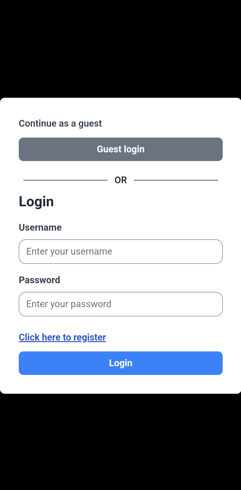

# echoSpace

**echoSpace** is a web application built with Django Channels, Tailwind CSS, and WebSocket, allowing users to create accounts, join rooms and chat in real-time.

- [Features](#features)
- [Technologies Used](#technologies-used)
- [Upcoming Features](#upcoming-features)
- [Screenshots](#screenshots)
- [Installation](#Installation)
- [Usage](#usage)
- [Project Structure](#project-structure)

## Features

- **User Authentication**: Register, log in, and manage account details.
- **Profile Management**: Update first name, last name, username, and profile picture.
- **Room Management**: Create and join voice rooms.
- **Real-Time Chat**: Communicate with others in the same room.
- **User List**: View a list of all registered users.

## Technologies Used

- **Backend**: Django
- **Frontend**: HTML, CSS, JavaScript, Tailwind CSS, AJAX
- **Real-Time Communication**: WebSocket, Django Channels
- **Database**: SQLite3
- **Redis**: Caching layer for frequently accessed data. 
- **Development Tools**: Postman

## Upcoming Features

- **Voice Room Feature**: Implementation using WebRTC to enable real-time voice communication within rooms.
- **Message Notifications**: Planning to implement real-time notifications using Django Channels and WebSocket, allowing users to receive alerts for new messages.
- **UI Improvements**: Enhancing the user interface using React.js for a more dynamic and responsive experience.

## Screenshots
<div style="text-align: center; margin-bottom: 20px;">
  
</div>
<div style="display: flex; flex-wrap: wrap; justify-content: center; align-items: center; gap: 5%;">
  
  
  
  
  

</div>
<div style="display: flex; flex-wrap: wrap; justify-content: center; gap: 5%; margin-top:20px">
  
  
</div>

## Installation

1. **Set Up Virtual Environment**

   ```bash
   python3 -m venv env
   ```
2. **Clone the Repository**

   ```bash
   git clone https://github.com/aslammiya/echospace
   cd echospace
   ```
3. **Activate Virtual Environment**

   **On macOS/Linux:**
     ```bash
     source env/bin/activate
     ```
   **On Windows:**
     ```cmd
     .\env\Scripts\activate
     ```

4. **Start Redis Server**
   ```bash
   redis-server
   ```
   **For detailed instructions on setting up Redis, refer to the [Install Redis on Linux, macOS, and Window.](https://redis.io/docs/latest/operate/oss_and_stack/install/install-redis/)**

   **OR**   
   
   **Alternatively, you can use [Redis CLoud](https://redis.io/docs/latest/operate/rc/rc-quickstart/)**

4. **Install Dependencies**

   ```bash
   pip install -r requirements.txt
   ```

5. **Set Up Database**

   ```bash
   ./manage.py migrate
   ```

6. **Create Superuser (Optional)**

   ```bash
   ./manage.py createsuperuser
   ```

7. **Configure Redis**

   - **For Local Development**: Uncomment the following lines in `core/settings.py` and comment out the `REDIS_URL` section.

     ```python
     CHANNEL_LAYERS = {
         "default": {
             "BACKEND": "channels_redis.core.RedisChannelLayer",
             "CONFIG": {
                 "hosts": [("localhost", 6379)],
             },
         },
     }
     ```

   - **For Production**: If you are using a Redis cloud service, `uncomment` the `REDIS_URL` line and comment out the local configuration.

     ```python
     REDIS_URL = os.environ.get('REDIS_URL')

     CHANNEL_LAYERS = {
         "default": {
             "BACKEND": "channels_redis.core.RedisChannelLayer",
             "CONFIG": {
                 "hosts": [REDIS_URL],
             },
         },
     }
     ```

   Set the `REDIS_URL` `environment variable` to your Redis instance URL in production environments like `Heroku` or `Render`.

    Alternatively, you can use:

   ```bash
   REDIS_URL="redis://:your_redis_password@your_redis_host:port/0"
   ```
    **For detailed instructions on setting up Redis Cloud, refer to the [Redis Cloud Quickstart Guide.](https://redis.io/docs/latest/operate/rc/rc-quickstart/)**
8. **Start Django-tailwind**

   ```bash
   ./manage.py tailwind start
   ```

9. **Run the Application**

   ```bash
   daphne -b 0.0.0.0 -p 8000 core.asgi:application
   ```

   Alternatively, you can use: `unicorn`

## Usage

- **Access the Web App**: Open your browser and navigate to `http://localhost:8000` (or the port you specified).
- **Log In / Register**: Use the provided forms to create an account or log in.
- **Create / Join Rooms**: Use the left-side panel to manage and join voice rooms.
- **Chat in Rooms**: Communicate with other users in the same room.

## Project Structure
```
├── core
│   ├── asgi.py
│   ├── __init__.py
│   ├── settings.py
│   ├── urls.py
│   └── wsgi.py
├── db.sqlite3
├── home
│   ├── admin.py
│   ├── apps.py
│   ├── consumers.py
│   ├── __init__.py
│   ├── migrations
│   ├── models.py
│   ├── routing.py
│   ├── static
│   │   ├── css
│   │   │   └── style.css
│   │   ├── favicon.ico
│   │   ├── images
│   │   │   ├── dp.png
│   │   │   ├── github.png
│   │   │   ├── insta.png
│   │   │   └── linkdin.png
│   │   └── js
│   │       ├── main.js
│   │       ├── register.js
│   │       └── rooms.js
│   ├── templates
│   │   ├── base.html
│   │   ├── homeLobby.html
│   │   ├── index.html
│   │   ├── loginUser.html
│   │   ├── roomLobby.html
│   │   └── userRegistration.html
│   ├── tests.py
│   └── views.py
├── manage.py
├── media
│   ├── profile_pictures
│   │   ├── 
│   └── screenshots
│       ├── ds_1.png
│       ├── ds_2.png
│       ├── ds_3.png
│       ├── ds_5.png
│       ├── ds_6.png
│       ├── ph_1.png
│       ├── ph_2.png
│       ├── ph_3.png
│       ├── ph_4.png
│       ├── ph_5.png
│       └── ph_6.png
├── staticfiles
│   ├── 
├── theme
│   ├── 
├── node_modules
│   ├── 
├── package.json
├── package-lock.json
├── README.md
├── render.yaml
├── requirements.txt
├── runserver.log
└── tailwind.log
```

## Contributing

Feel free to submit issues or pull requests. Contributions are welcome!
